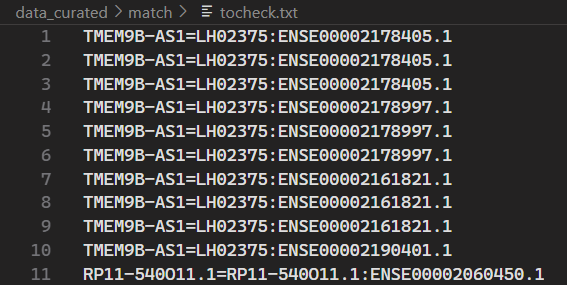
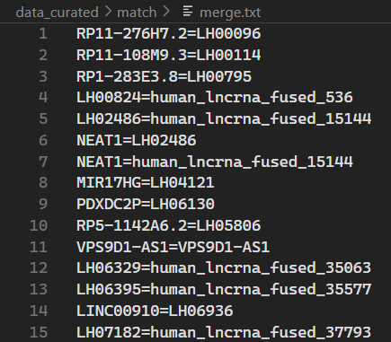

# Data Collection and Processing Process

## Essential lncRNA Verified by CRISPR Experiment

### 1. Download the data from the original literature and the genomic reference annotation file.

- CRISPR i  
  - Experimental and Analytical Results [Supplementary Table S4][https://www.science.org/action/downloadSupplement?doi=10.1126%2Fscience.aah7111&file=aah7111-tables4.xlsx] 
  - The reference genome annotation used in the study: genomic information(hg19)[ GTF](https://github.com/symbiologist/dualgenomewide/blob/main/analysis/reference/output/00_lncrna_reference/lncrna.gtf.gz)
- CRISPR delete
  - MAGeCK results of negatively and positively selected lncRNAs in Huh7.5 cell line.  [Supplementary Table 5](https://static-content.springer.com/esm/art%3A10.1038%2Fnbt.3715/MediaObjects/41587_2016_BFnbt3715_MOESM32_ESM.xlsx) 
  - MAGeCK results of negatively and positively selected lncRNAs in HeLa cell line. [Supplementary Table 9](https://static-content.springer.com/esm/art%3A10.1038%2Fnbt.3715/MediaObjects/41587_2016_BFnbt3715_MOESM36_ESM.xlsx)
  - The reference genome annotation used in the study:[GENCODEV19](https://ftp.ebi.ac.uk/pub/databases/gencode/Gencode_human/release_19/gencode.v19.long_noncoding_RNAs.gtf.gz)
- CRISPR splice  
  - Screen scores of lncRNAs by splicing-targeting screen in multiple cell lines [Supplementary Table 6](https://static-content.springer.com/esm/art%3A10.1038%2Fnbt.4283/MediaObjects/41587_2018_BFnbt4283_MOESM23_ESM.xlsx)
  - The source of the coding gene symbols used to exclude and obtain the final lncRNA results.[Supplementary Table 3,positive ctrl sheet](https://static-content.springer.com/esm/art%3A10.1038%2Fnbt.4283/MediaObjects/41587_2018_BFnbt4283_MOESM20_ESM.xlsx)

  - The reference genome annotation used in the study: enomic information(hg38) [GENCODEV20]()
- CRISPR CasRx
  - Genomic annotation information and screen score information files used in the experiment. [Supplementary Table](https://static-content.springer.com/esm/art%3A10.1038%2Fs41592-024-02190-0/MediaObjects/41592_2024_2190_MOESM4_ESM.zip)
- LncRNA 
  - NONCODE V6 LncRNA and LncRNA Genes[ NONCODEv6_hg38.lncAndGene.bed.gz](http://www.noncode.org/datadownload/NONCODEv6_hg38.lncAndGene.bed.gz);[ NONCODEv6_human.fa.gz](http://www.noncode.org/datadownload/NONCODEv6_human.fa.gz)
  - LncBook V2.0[ lncRNA_LncBookv2.0_GRCh38.gtf.gz](https://ngdc.cncb.ac.cn/lncbook/files/lncRNA_LncBookv2.0_GRCh38.gtf.gz); [ lncRNA_LncBookv2.0.fa.gz](https://ngdc.cncb.ac.cn/lncbook/files/lncRNA_LncBookv2.0.fa.gz)
  - GENCODE V47[gencode.v47.long_noncoding_RNAs.gtf](https://ftp.ebi.ac.uk/pub/databases/gencode/Gencode_human/release_47/gencode.v47.long_noncoding_RNAs.gtf.gz)
  - HGNC[non-coding_RNA.txt]( https://storage.googleapis.com/public-download-files/hgnc/tsv/tsv/locus_groups/non-coding_RNA.txt)

### 2. Essential long non-coding RNA gene screening and filtering

Different studies use various methods to measure the impact of lncRNAs on cell viability, and we need to filter based on the settings established in each study.

| citation                                                     |
| ------------------------------------------------------------ |
| **CRSPR i**[^1]|
| **CRISPR splice:**[^2] |
| **CRISPR_delete:**[^3] |
| **CRISPR casRx:**[^4]|

- **CRISPR i  :**  Extracting information from the table involves filtering different cell lines according to the columns. The criteria for retention are that the `lncRNA gene hit type`columns value must be `lncRNA hit` [^1] and the `screen score` columns value must greater than 7 [^1]and the `ave_Rep1_Rep2|average phenotype of strongest 3 sgRNAs)`column value must be less than 0 (i.e., a value less than 0 indicates that knocking out or interfering with this gene will inhibit cell growth, while a value greater than 0 indicates the opposite).
   > According to the results provided in Figure 1E of reference[^1], for the MDA-MB-231 and MCF7 cell lines,the `gamma_T0vT20` column is selected. For the iPSC cell line and other cell lines,the `gamma_T0vT12`column is selected.

  

- **CRISPR delete:** To extract essential non-coding lncRNAs from the table,follow these three criteria: 
   1)Select only the tables that indicate `Negative selection`; 2)Retain rows where the`neg|fdr`column has values less than 0.25, the parameters are set according to the standards provided in the literature [^3]; 3) Remove rows that correspond to coding genes(i.e.,rows where the ID column is not labeled with`_lncrna`).

  

- **CRISPR splice :** To extract necessary non-coding lncRNAs from the table,apply the following criteria: 

  1)Retain rows where the`Gene_symbol`column indicates non-coding RNAs: Exclude the gene symbols of the control coding genes mentioned in the literature.`/match/coding_gene.txt`(Extracted from Supplementary Table 3 positive ctrl sheet); 
  
  2)Keep only those rows where the`Screen_score`column has values greater than **2**. The parameters are set according to the standards provided in the literature[^2].

  

- **CRISPR CasRx :** In the "Supplementary_table12.csv" file, the relevant analysis information for this study is stored. We extract the table information based on the `dropFDR` column value being less than 0.25 and the `library` column being "ALBAROSSA_library" for a specific cell line. Here, only one cell line is displayed. The parameters are set according to the standards provided in the literature [^4].


- **Result** In the aforementioned study, all essential long non-coding RNA entries of interest, including their identifiers from experiments (custom gene IDs or public database gene names), cell lines,  experimental scores and PUBMED ID have been manually recorded in `/curated/exp_crispr.csv`.  


Due to differences in eras and annotation discrepancies, we need to further update and supplement the annotations to construct a high-quality, usable dataset. 

### 3. Annotations Updates and Complements

#### Genome Coordinate Alignment

1. Store the extracted lncRNA identifiers as a list in the first step.

   - crispri_id.txt
   - crispr_delete_id.txt
   - crispr_splice_id.txt
   - crispr_casrx_id.txt
   
2.  Extract the annotation information corresponding to the reference genome.For instance,in the crispr delete study,lncRNAs from gencode v19 were utilized.We downloaded the original reference gtf file and extracted the annotation information generate bed files.

   - crispri19.bed: 
   - crispr_delete19.bed
   - crispr_splice38.bed

   Details see code: `/match/coor_match.ipynb:step1` 
   
   > In the CRISPR-splice matching process,only LINC00869 matched to two genes:ENSG00000226067.3;ENSG00000277147.1.We used the sgRNA sequence lin2176_s_39054: CCTCTGTCCCTTCTATTCCC provided in the literature for BLAST similarity search and matched it to ENSG00000226067.
   
   >  After executing the aforementioned code, adjust the code to generate   crispr_xxxx_seq.bed  . If it's the hg19 version, further operations are required to convert to hg38.
   >
   > ```python
   > id_field = extract_attribute(attributes, 'exon_id') 
   > #-->
   > id_field = extract_attribute(attributes, 'transcript_id')
   > ```
   >  Generate   crispr_splice_seq.bed   and   crispr_delete_seq.bed,crispri_seq.bed   (after liftover conversion to hg38).
   
   > **Noted that** : The supplementary data of the (CRISPR casRx) literature provides the reference coordinates for the hg38 genome.After organizing the coordinate positions in Supplementary_table2.tsv and Supplementary_table3.tsv,a bed format file was generated.(/match/crispr_casRx.bed).

#### Genome Coordinate convert

Using the LiftOver tool to convert the hg19 version to hg38.

```
# Download the Liftover tool.
wget http://hgdownload.soe.ucsc.edu/admin/exe/linux.x86_64/liftOver
# Download the chain file.
wget http://hgdownload.soe.ucsc.edu/goldenPath/hg19/liftOver/hg19ToHg38.over.chain.gz
```

Prepare the input BED file ,`crispri.bed`and`crispr_delete.bed`

Run LiftOver e.g.

```
./liftOver crispri/crispri18.bed hg19ToHg38.over.chain.gz crispri38.bed unmapped.bed
```

`unmapped.bed`: Contains unmapped regions with reasons for failure. 
 Those that fail to convert require further manual inspection and processing.（Delete the entries in the converted BED file that contain these gene IDs.）


#### Merge lncRNA entries

1. The merging criterion is based on the lowest exon-level coordinate range to combine lncRNA entries from four different literature sources; if two genes contain at least one transcript in common and on the same strand, they are considered the same gene.

```
# for example
bedtools intersect -a crispr_delete38.bed -b crispr_splice38.bed -wo -s -r -f 1 > temp.bed
# For genes with individual exons that are 100% overlapping in the results processed by bedtools, manual checks are
# conducted. Sequence region annotations updates caused by updates to public databases, 
# such as (GENCODE), are also merged into the same entry.
# For example: RP11-540O11.1-RP11-540O11.1, TMEM9B-AS1-LH02375, etc.
```

 Details see code: `/match/coor_match.ipynb:step3`. Conduct manual checks on the exons reported in `tocheck.txt` that have 100% overlap.



2. Generate a merge.txt file. The complete merge process can be seen in the code:`/match/coor_match.ipynb:step4`.Only the **NEAT1** group has three genes that can be merged; manually modify and combine them into one group.

   

#### Map the coordinate ranges to th latest public database to obtain annotations

Obtain gene IDs from the NONCODE V6 , LncBook V2.0,and GENCODEV47 databases to enhance data usability.

1. Convert GTF files into custom BED files for ease of subsequent filtering.(`/match/map_annotations.ipynb:Step1.1`)

2. Based on the complete matching of the coordinate ranges at the lowest exon level,if the exons of the lncRNA we have collected are completely equal to or covered by the exons of the lncRNA in the reference database,and are on the same strand,they can be mapped to the corresponding reference lncRNA.If a gene matches multiple genes,select the one with the largest overlapping range.
   Details see code:(`/match/map_annotations.ipynb:Step2`)

3. Generate database annotations **mapping files**. See the detailed selection code at`/match/map_annotations.ipynb:step2`

   **mapping files**:`lncbook_map.tsv,noncode_map.tsv,gencode_map.tsv`,`res_map.tsv`

#### Map the  Ontology Annotations 

1. Through the non-coding_RNA.txt file provided by HGNC,you can obtain the mapping from gene_name(symbol)to NCBI gene id(entrez_id).

2. Use the `GeneSummary` R package to obtain Gene Ontology annotations via NCBI gene ID. After integrating all lncRNA entries,export all matched NCBI gene ids. (`/match/ncbi_gene_id.txt`)

   - Install `GeneSummary` R package in R 4.3.3

   ```R
   if (!require("BiocManager", quietly = TRUE))
       install.packages("BiocManager")
   
   BiocManager::install("GeneSummary")
   ```

   - Execute the script file.`/match/map_go.R`
   
3. The code for importing the aforementioned data into the database can be found at:`/store/dbess.ipynb:step3.2`

#### To obtain sequence 

1. Handling BED file format for easy processing, Process the`crispr_splice_seq.bed`,`crispr_delete_seq.bed`,`crispri_seq.bed`files(after liftover conversion to hg38) generated in the`/match/coor_match.ipynb:step1` and `crispri38.bed`,`crispr_casRx.bed`,to create custom bed files(seq_xxx.bed) that can be processed by subsequent code.
   Detatils see code:`/gene_fa.ipynb:step1`

2. Using the REST API provided by Ensembl to obtain the sequence of a gene region.`/match/get_seq.py`

   ```python
   python get_seq.py
   ```

3. Based on public lncRNA databases such as NONCODE that store exon-level sequences, splice the sequences from previous step and generate a FASTA file(`lncRNA2.fasta`)
   Details see code:`/match/gen_fa.ipynb:step3`

   > Before this step,you need to modify the content of`coor_match.ipynb`step1,specifically for the Gencode GTF file.
   > `id_field = extract_attribute(attributes, 'exon_id') -->id_field = extract_attribute(attributes, 'transcript_id')`
   > See the code.`/match/gen_fa.ipynb`


## Putative Essential lncRNA Based on Variant assocate with lethal phenotypes Data from the ClinVar Database

### 1. Download the data from the public database and the genomic reference annotation file.

- Variants
  - Tab-delimited report for variants which have been submitted to ClinVar [variant_summary.txt.gz](https://ftp.ncbi.nlm.nih.gov/pub/clinvar/tab_delimited/variant_summary.txt.gz)
  - VCF file of variants with precise endpoints [clinvar.vcf.gz](https://ftp.ncbi.nlm.nih.gov/pub/clinvar/vcf_GRCh38/clinvar.vcf.gz)
  - XML file with variant length [ClinVarVCVRelease_00-latest.xml.gz](https://ftp.ncbi.nlm.nih.gov/pub/clinvar/xml/ClinVarVCVRelease_00-latest.xml.gz)
- LncRNA 
  - NONCODE V6 LncRNA and LncRNA Genes[ NONCODEv6_hg38.lncAndGene.bed.gz](http://www.noncode.org/datadownload/NONCODEv6_hg38.lncAndGene.bed.gz)
  - LncBook V2.0[ lncRNA_LncBookv2.0_GRCh38.gtf.gz](https://ngdc.cncb.ac.cn/lncbook/files/lncRNA_LncBookv2.0_GRCh38.gtf.gz)
  - The hg38 coordinate file(1 base) of lncRNAs that have been validated by CRISPR, from`/store/dbess.ipynb:Step2.1`.
    file:`/store/crispr.txt` 

### 2. Variants filtering and putative essential long non-coding RNA gene labelling.

#### Variants filtering 

1. Filter variants in `variant_summary.txt`. Firstly, the `Assembly` field should be `GRCh38`. Secondly, retain variants with at least one star and without conflicts. Finally, filter out variants that do not appear in the `clinvar_20240603.vcf` file. Meanwhile, `RCVaccessions` with incomplete phenotypic information were retrieved. (Script: `/clinvar_map/variants/left-shift/pre_process.py`)

2. Using the API provided by NCBI to obtain the complete list of phenotypes based on RCV accessions. (Script: `/clinvar_map/varinats/left_shift/get_conditions_by_RCV.py`)

3. Use the obtained phenotype list to complete the missing information and generate a complete and deduplicated list of phenotypes. (Script: `/clinvar_map/variants/left-shift/complete_phenotype.py`)

4. Find out the lethal and life-threatening phenotypes according to the filtering rules. (Script:`/clinvar_map/phenotype/phenotype_screen.py`)

5. Obtain the variant length from `ClinVarVCVRelease_2025-06.xml`. (Script: `/clinvar_map/variants/left-shift/get_length_xml.py`)

6. Retain variants with a length of ≤100bp and containing lethal phenotypes and calculate the left-shift coordinates for the variants. (Script: `/clinvar_map/variants/left-shift/after_process.py`)
#### Merge reference lncRNAs

1. Merge lncRNAs from NONCODEv6 and LncBookv2.0

   Use `bedtools` to identify lncRNAs that have the same coordinate. (Script: `/clinvar_map/lncRNA_reference/merge_noncode_lncbook.sh`)

2. Merge lncRNAs from the two databases, retaining only one record for lncRNAs with same coordinate. (Script: `/clinvar_map/lncRNA_reference/merge.py`)

#### Map variants to reference lncRNAs set

1. Map variants to reference lncRNA set using `bedtools`. (Script: `/clinvar_map/map/map.sh`)
2. Map result statistics (Script: `/clinvar_map/db/statistic/statistic.py`)
   - Count putative essential lncRNAs that overlap with variants associated with lethal phenotypes.(`/clinvar_map/db/statictis/lncRNA.csv`)
3. Annotate additional annotations for lncRNAs
   - Extact `Noncode ID` and `Lncbook ID` for ID conversion.(Script:`/clinvar_map/db/conversion/get_id_for_conversion.sh`)
   - Use the LncBook [**ID Conversion Tool** ](https://ngdc.cncb.ac.cn/lncbook/tools/conversion)to query the `NCBI_ID`, `gene_name` and `ensembl_id`  for lncRNAs. (Script: `/clinvar_map/db/conversion/id_conversion.py`) Generate:`/clinvar_map/db/conversion/lnbook_conversion_results.csv`and`/clinvar_map/db/conversion/noncode_conversion_results.csv`
   - Merge`/clinvar_map/db/statistic/lncRNAs`, `/clinvar_map/db/conversion/lnbook_conversion_results.csv` and`/clinvar_map/db/conversion/noncode_conversion_results.csv`. (Script: `/clinvar_map/db/conversion/merge_NCBI_symbol.py`)
4. Filter out putative essential lncRNAs that have CRISPR experimental evidence(`/store/crispr.txt`). If a putative essential lncRNA has exactly the same coordinates as another essential lncRNA with experimental evidence, the putative essential lncRNA is deleted. Delete mappings associated with these putative essential.(Script:`/clinvar_map/crispr_overlap/filter_out.sh`) Generate:(`/clinvar_map/db/crispr_overlap/final_lncRNA_nocrispr.bed`) 
5. Count variants associated with lethal phenotypes map to putative essential that don't have CRISPR experimental evidence. Count the mappings between variants associated with lethal phenotypes and putative essential lncRNAs. (Script:`/clinvar_map/criepr_overlap/statistic.py`) Generate:`/clinvar_map/db/crispr_overlap/variants_nocrispr.csv` and `/clinvar_map/db/crispr_overlap/lncRNA_variant_mapping_nocrispr.csv`

#### Map variants to  essential lncRNAs verified by CRISPR experiments.

1. Convert the txt file of essential lncRNAs verified by CRISPR experiments(`/store/crispr.txt `generated in`/store/dbess.ipynb:Step2.2 Export data for variants mapping`) to bed file. Map variants to lncRNAs using `bedtools`.(Scripts:`/clinvar_map/crispr_map/map.sh`)

2. Result statistics (Script: `/clinvar_map/db/crispr_map/statistic.py`)
   - Count experimentally verified essential lncRNAs that overlap with variants associated with lethal phenotypes.
     Generate： `/clinvar_map/db/crispr_map/crispr_lncRNA.csv`
   - Count variants associated with lethal phenotypes overlapped with experimentally verified essential lncRNAs.
     Generate：`/clinvar_map/db/crispr_map/crispr_variants.csv`
   - Organize the mapping relationship between variants and lncRNAs.
     Generate：`/clinvar_map/db/crispr_map/crispr_mapping.csv`

## Sorting out the essential lncRNAs obtained through literature mining

1. A total of 173  human essential lncRNAs and 34 mouse essential lncRNAs and their annotations  were manually collected from dbesslnc.
   - `/dbesslnc/dbesslnc.txt`:Human essential lncRNA ID file.
     `/dbesslnc/dbesslnc_reason.txt`: detailed introduction of human essential lncRNA.
   - `/dbesslnc/dbesslnc_mouse.csv`: Annotation file of essential lncRNAs in mice(manually assigned UIDs,such as ELM000001 and Coordinate range.).
     `/dbesslnc/dbesslnc_mouse_trans.txt`: Mouse essential lncRNA transcript file.
   - `/dbesslnc/dbesslnc_mouse_expression.csv`:Mouse expression data file.

2. Generate a mapping file between `gene_name` and `gene_id` through`/match/map_annotations.ipynb:step1.1` Generate files: `/match/gene_mapping.txt`.
   Based on this file,use `gene_name` as the key to obtain `gene_id`, and according to `gene_id`, retrieve annotation information from`/clinvar_map/lncRNA_redference/NONCODE_LncBook_same_merged.bed`. 
   For lncRNAs that fail to map, obtain the information again using `Noncode_id`. (Script: `cancer/proDbessLnc.py`) Generate files:`dbesslnc_gene.csv`,`unmap_from_dbesslnc.csv`

3. For the remaining **6** lncRNAs(`dbesslnc_gene_remaining.csv`) that could not have their coordinate information retrieved from the reference lncRNA collection, manually search and supplement annotation information in the genecards database.`/dbesslnc/unmap_from_dbesslnc.txt`


4. For the lncRNAs derived from mice of the dbesslnc strain,we have also conducted additional annotation.
   - Download the reference file for mouse lncRNAs: [NONCODEv6_mm10.lncAndGene.bed.gz](http://www.noncode.org/datadownload/NONCODEv6_mm10.lncAndGene.bed.gz)
   - Extract transcript coordinates and exon information from the reference BED file of mouse lncRNAs using `/dbesslnc/get_exon_mouse.sh`.
   - Retrieve the mapping table of essential mouse lncRNAs NONCODE gene IDs and transcript IDs from the dbesslnc database (file: `dbesslnc_mouse_trans.txt`).
   - Annotate transcript information for essential mouse lncRNAs using `/dbesslnc/getExonMouse.py`.  Generate: `mouse_trans.csv`.

## Data management and storage into the database.

Using MySQL 8.0.40 for storing and managing databases.

For the database schema, please refer to the file   `/store/dbess_schema.sql`  .

1. Import the table structure file.

   ```
   mysql -u username -p
   USE database_name;
   SOURCE /path/to/your/dbess_schema.sql;
   ```

   

2. Import the lncRNA gene into the **esslnc** table. Execute the data import code `/store/dbess.ipynb：Step2,3` When importing data,simply modify the corresponding file names,table names,and field names, 

   - **Step2:Import gene entries**:Import genomic annotation information of human lncRNA genes from **three** data sources.
     details see code:`/store/dbess.ipynb：Step2`
   - **Step2.6: Import the mouse's essential lncRNA(from dbesslnc)**:import `dbesslnc_mouse.csv` to esslnc
   - **Step3.1: Import the mapped gene IDs(for lncRNA verified by CRISPR  )**
     import the mapped public database gene IDs and gene names,along with other mapped data
     details see code:`/store/dbess.ipynb：Step3.1`
   - **Step3.2: Import the mapped  NCBI gene IDs and Go annotations**
     details see code:`/store/dbess.ipynb：Step3.2`

   > During the genome version conversion process, genes that fail to convert are manually checked and entered into the database.

3. Generate unique identifiers for human lncRNA to facilitate system management.Assign unique identifiers to the collected lncRNA genes following the allocation principle:`ELH+xxxxxx`,for example,`ELH000001`. 
   The unique identifiers of mice are the same as mentioned above.(`ELM+xxxxxx`)
   details see code:`/store/dbess.ipynb：Step4`
   
4. Import transcript annotations into the **trans** table (lncRNA verified by CRISPR). 

   - Using the UID from the previous step,generated by`dbess.ipynb:Step4.2`,the`seq_xxx.bed`generated by`/match/gen_fa.ipynb`,and the`/match/lncRNA2.fasta` file,generate basic annotations for transcripts and import them into the database.
   - Map public database IDs using `lncbook_map.tsv` and `noncode_map.tsv`.
   - For detailed code,see`/store/dbess.ipynb:Step5,6`.

5. Import transcript annotations into the **trans** table(lncRNA non verified by CRISPR)

   - Using the UID from the previous step,generated by`dbess.ipynb:Step4.5`,`non_crispr_UID.txt`
   - Extract the basic annotation information of these lncRNAs and import it into the database.Count the number of exons and record the coordinate for all reference lncRNA transcripts. (Script: `/clinvar_map/lncRNA_reference/get_exon.sh`).Retrieve the number and the coordinate of exon for  transcripts of all essential lncRNA genes. (Script: `/clinvar_map/db/exon/getExon.py`)
     Generate:`/clinvar_map/db/exon/non_crispr_lncRNA.csv`,Import this file by:`/store/dbess.ipynb:step5.3`
   - Extract sequences from NONCODE and LncBook databases and import them into the database.details see code:`/store/dbess.ipynb:step5.3`
   - details see code:`/store/dbess.ipynb:step5.2,step5.3`

   - Import mouse transcript information annotated with transcript coordinate information(`/dbesslnc/mouse_trans.csv`). 

6. Import CRISPR experiment record`exp_crispr.csv` into **exp_crispr** table.

   - Details see code:`/store/dbess.ipynb:Step7`
   - Group by  `exp_type`  and  `target_id`  columns, for groups with a count of 1, mark as 'cell-line specific' and update in the table; for groups with a count of 2-5, mark as 'common essential'; and for groups with a count greater than 5, mark as 'core essential'.Details see code:`/store/dbess.ipynb:Step7.1`

7. Import variants Mapping file into **lncrna_variant_mapping** table and variants file into the **variants** table

   - Create a local mapping table for lncRNA verified by crispr through `/store/dbess.ipynb: Step4.3` 
     Generate:`/store/crispr_map.txt`. 
   - Create a local mapping table for disease_related lncRNAs through `/store/dbess.ipynb: Step4.4` 
     Generate:`/store/disease_map.txt`. 
   - Replace `target` in `/clinvar_map/db/crispr_map/crispr_mapping.csv` with  `UID`    (Script:   `/clinvar_map/db/construct_map/get_map_crispr.py`  ).
     Generate:`/clinvar_map/db/construct_map/final_crispr_mapping.csv`
   - Replace `Noncode_id` and` Lncbook_id` in `/clinvar_map/db/crispr_overlap/lncRNA_variant_mapping_nocrispr.csv` with  `UID`    (Script:   `/clinvar_map/db/construct_map/get_map_nocrispr.py`  ).
     Generate:`/clinvar_map/db/construct_map/final_nocrispr_mapping.csv`
   - Import the table generated above.For detailed code,see`/store/dbess.ipynb:Step8`.

8. Import human lncRNA esspression file into **exp_profile** table

   - Create a local mapping table for  transcrispt `trans.txt`
   - Download the expression profile file for lncRNAs from LncExpDB: [expression_profiles_HPA.tar.gz](ftp://download.big.ac.cn/lncexpdb/1-NormalTissuesAndCellLines/1-TheHumanProteinAtlas/expression_profiles_HPA.tar.gz "size: 694.28M, last update: 2020-08-13") .
   - Calculate the mean TPM (Transcripts Per Million) of lncRNAs across different tissues. (Script: `/clinvar_map/db/exp/cal_exp.py`)
   - Retrieve the expression profile of lncRNAs. (Script: `/clinvar_map/db/exp/get_exp.py`
   - Import the table generated above.For detailed code,see`/store/dbess.ipynb:Step9`.

[^1]: Liu S J, Horlbeck M A, Cho S  W, et al. CRISPRi-based genome-scale identification of functional long  noncoding RNA loci in human cells[J]. Science, 2017, 355(6320): eaah7111. 

[^2]: Liu Y, Cao Z, Wang Y, et al. Genome-wide screening for  functional long noncoding RNAs in human cells by Cas9 targeting of splice  sites[J]. Nature Biotechnology, 2018, 36(12): 1203-1210. 

[^3]: Zhu S, Li W, Liu J, et al. Genome-scale deletion screening of  human long non-coding RNAs using a paired-guide RNA CRISPR–Cas9 library[J].  Nature Biotechnology, 2016, 34(12): 1279-1286. 

[^4]: Montero J J, Trozzo R, Sugden M, et al. Genome-scale  pan-cancer interrogation of lncRNA dependencies using CasRx[J]. Nature  Methods, 2024: 1-13. 


